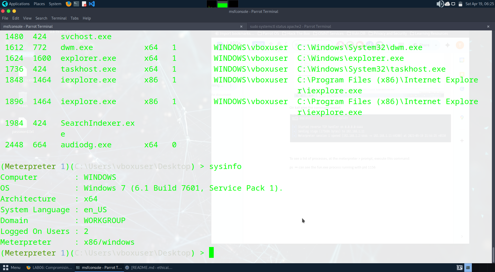

# Compromising-windows-using-Metasploit
Compromising windows using Metasploit
# Metasploit
Compromising windows using Metasploit

# AIM:

To Compromise windows using Metasploit .

## DESIGN STEPS:

### Step 1:

Install kali linux either in partition or virtual box or in live mode

### Step 2:

Investigate on the various categories of tools as follows:

### Step 3:

Open terminal and try execute some kali linux commands

## EXECUTION STEPS AND ITS OUTPUT:

sudo msfvenom

ifconfig

status of apache2

ls

exploit

ps

sysinfo

netstat

keyscan

fun.exe file

## RESULT:
The Metasploit framework is  used to compromise windows and is examined successfully.
